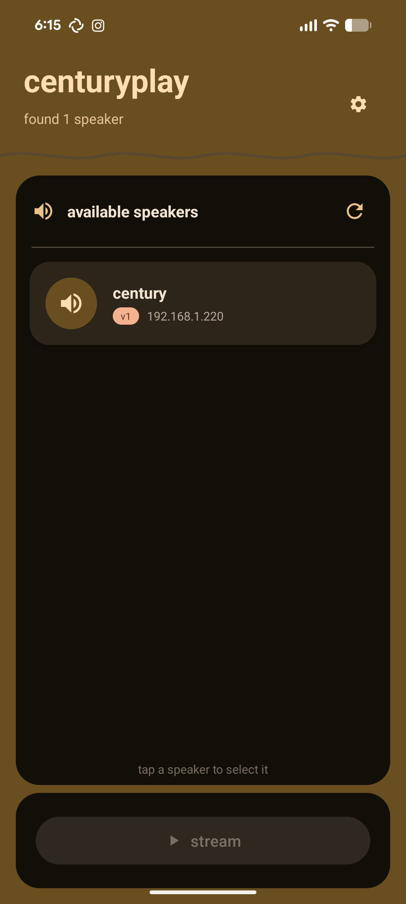
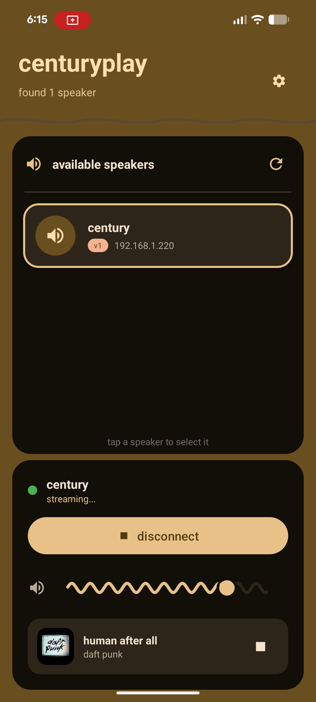
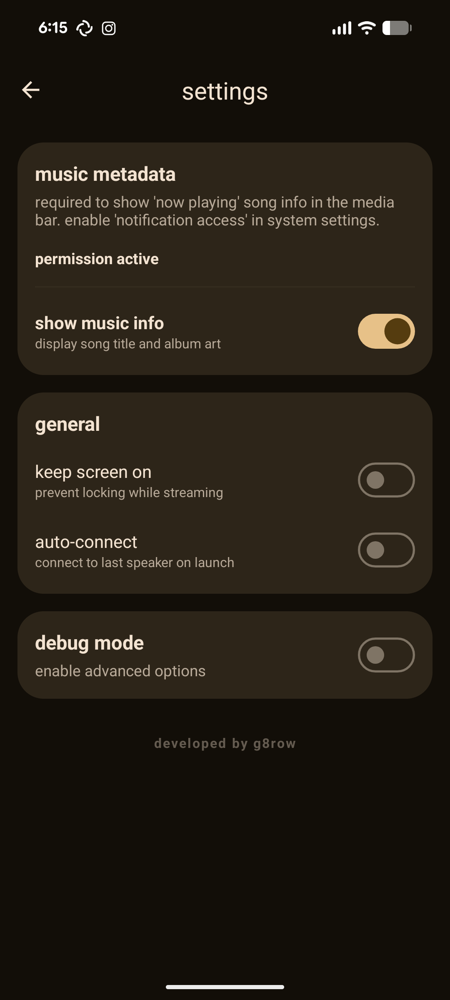

# centuryplay

stream audio from your android device to airplay speakers.


<div align="center">
  
  
  
</div>

<div align="center">
  <p><i>main interface • active streaming • settings</i></p>
</div>

## the story

started as a way to breathe new life into a bang & olufsen beosound century - a beautiful 1990s hi-fi system with stunning sound quality but no wireless capabilities. by adding a raspberry pi running [shairport-sync](https://github.com/mikebrady/shairport-sync), the century can now receive airplay streams.

centuryplay completes the chain by letting android devices stream system audio to shairport-sync (or any airplay receiver), effectively turning a vintage b&o system into a modern wireless speaker.

## features

- system audio capture: stream any audio playing on your device.
- auto discovery: automatically find airplay devices via mdns/bonjour.
- encrypted streaming: aes-128-cbc encryption with rsa key exchange.
- synchronized playback: proper rtp timing and sync packets.
- volume control: adjust volume on the receiver.
- music player integration: now playing metadata and controls.

## lossless & hi-res audio

### does it work with apple music lossless?

yes. when playing apple music (or any other source) on android, this app captures the audio and streams it over airplay. however, there are caveats regarding android's audio pipeline.

### android audio resampling

| source | android behavior | stream output |
|--------|------------------|---------------|
| 44.1 khz (cd quality) | no resampling | bit-perfect |
| 48 khz | native | bit-perfect |
| 96 khz hi-res | resampled to 48 khz | downsampled |
| 192 khz hi-res | resampled to 48 khz | downsampled |

key points:
- android's mixer typically runs at 48 khz.
- hi-res content is downsampled by android before reaching this app.
- airplay 1 only supports 44.1 khz, so additional resampling may occur.
- for true bit-perfect playback, exclusive usb audio mode would be required.

bottom line: excellent quality, but not bit-perfect hi-res. cd quality (16-bit/44.1khz) is handled cleanly.

## supported protocols

| protocol | status | notes |
|----------|--------|-------|
| airplay 1 (raop) | working | l16 pcm audio, encrypted |
| airplay 2 | in progress | coming soon |

## requirements

- android 10 (api 29) or higher.
- airplay-compatible receiver (e.g. shairport-sync, apple tv, homepod, airport express).

## installation

### from source

1. clone the repository:
   ```bash
   git clone https://github.com/g8row/centuryplay.git
   cd centuryplay
   ```

2. build with gradle:
   ```bash
   ./gradlew assembledbug
   ```

3. install the apk:
   ```bash
   adb install app/build/outputs/apk/debug/app-debug.apk
   ```

### from release

download the latest apk from the [releases](https://github.com/g8row/centuryplay/releases) page.

### cloud build

use our automated cloud build system for fast, reliable builds:

#### github actions (recommended)
- push to `main` or `develop` branch to trigger automatic builds
- create a release to build and publish signed release apks
- manual builds available via actions tab

#### local cloud build script
```bash
# build all variants (debug + release + tests + lint)
./scripts/cloud-build.sh

# build only debug
./scripts/cloud-build.sh debug

# build only release
./scripts/cloud-build.sh release

# run tests only
./scripts/cloud-build.sh test
```

#### docker-based builds
```bash
# using docker compose
docker-compose -f docker-compose.build.yml up --build

# individual services
docker-compose -f docker-compose.build.yml run android-builder
```

#### gitlab ci/cd
- automatically builds on push to branches
- supports multi-stage pipelines (build → test → security → deploy)
- artifact retention and deployment automation

see [`.windsurf/workflows/cloud-build.md`](.windsurf/workflows/cloud-build.md) for detailed cloud build configuration.

## usage

1. grant permissions: requires audio recording permission for capture.
2. start media: play audio/video on your device.
3. select device: tap an airplay device from the list.
4. allow capture: approve the screen/audio capture prompt.
5. stream: audio will play through your airplay speaker.

## how it works

uses android's `audioplaybackcapture` api to capture system audio, then streams it to airplay receivers using raop (remote audio output protocol).

```
┌─────────────┐     ┌──────────────┐     ┌────────────────┐
│   android   │────▶│  airplay     │────▶│   airplay      │
│   device    │     │  streamer    │     │   receiver     │
│  (audio)    │ pcm │  (this app)  │ rtp │  (speaker)     │
└─────────────┘     └──────────────┘     └────────────────┘
```

### technical details

- audio format: l16/44100/2 (16-bit pcm, 44.1khz, stereo).
- transport: rtp over udp.
- control: rtsp over tcp (port 5000).
- encryption: aes-128-cbc with rsa-oaep key exchange.
- timing: ntp-style timestamps with sync packets.

see [docs/airplay_protocol.md](docs/AIRPLAY_PROTOCOL.md) for detailed protocol documentation.

## tested receivers

| receiver | protocol | status | notes |
|----------|----------|--------|-------|
| shairport-sync v4.x | airplay 1 | working | recommended |
| shairport-sync v3.x | airplay 1 | working | |
| airport express | airplay 1 | working | |
| apple tv (gen 2-3) | airplay 1 | working | |
| apple tv 4k | airplay 2 | requires airplay 2 | in development |
| homepod / mini | airplay 2 | requires airplay 2 | in development |
| airscreen (android)| airplay 1 | issues | compatibility variations |

## limitations

- drm content: some apps block capture (netflix etc).
- latency: inherent ~2s buffer latency.

## changelog

### v1.0 (january 2026)
- music player integration: real-time metadata (title, artist, art) and controls.
- ui polish: minimal aesthetics, lowercase typography, neutral status indicators.
- settings: keep screen on, auto-connect, and layout fixes.
- technical: project configuration updated for stable release.

### v0.2 (january 2026)
- wavy volume slider.
- material 3 theming.
- connection monitoring.
- crash fixes.

### v0.1 (december 2025)
- initial release.
- airplay 1 (raop) support.
- mdns device discovery.
- encrypted audio streaming.

## development

see [development.md](DEVELOPMENT.md) for notes.

### tech stack

- language: kotlin
- ui: android views (viewbinding)
- architecture: mvvm + stateflow
- concurrency: coroutines + flow
- networking: raw sockets, jmdns
- crypto: bouncycastle

## contributing

contributions welcome. submit a pull request.

## license

mit license. see [license](LICENSE) file.

## acknowledgments

- [shairport-sync](https://github.com/mikebrady/shairport-sync)
- [unofficial airplay protocol spec](https://nto.github.io/AirPlay.html)

---

disclaimer: airplay is a trademark of apple inc. this project is not affiliated with apple inc.
